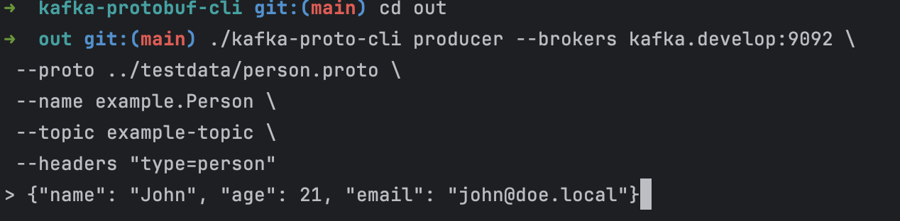

## Utility that sends a protobuf (converts it from JSON) message to the Kafka


## Installation

Make sure that you have Go installed on your machine. Then you can compile with the following command

```bash
make all
```

Once you compile it you will be able to use a binary called `kafka-proto-cli` in the out folder. 

```bash
kafka-proto-cli --brokers kafka.develop:9092 \
 --proto ../testdata/person.proto \
 --name example.Person \
 --topic example-topic \
 --headers "type=person"
```

Also, you need to provide messages in JSON format as shown in the picture.


